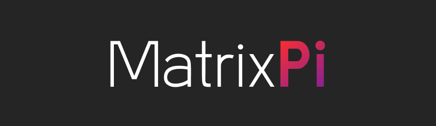

# MatrixPi: An RGB Matrix app framework Powered by Raspberry Pi


## App List
- Home (Core)
- Testing App

## App Repository Structure
Apps can be written in Python (recommended) or C++. 
If using C++, the app must be compiled and the executable in the app directory must be in the format `<appName>.app`
C++ Support is extremely limited at the moment.
```
app-name/
├─ executable
├─ manifest.yaml
├─ app-configs (optional)/
│  ├─ config.yaml (optional)
│  ├─ ...
```

## Manual App Installation Procedure
1. Clone your app into the `apps` directory
2. Add your app manifest details into the app library yaml (`library.yaml`)
3. Start your app by accessing the internal API, `https://ip-address-of-pi:8000/startApp?appName=appName`